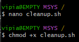
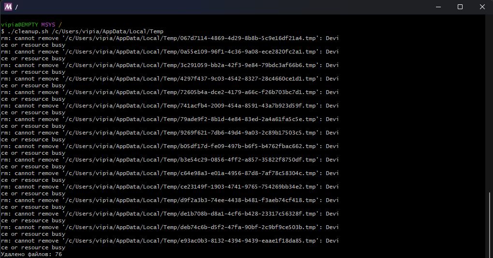

# cleanup.sh

## Описание
`cleanup.sh` — это простой shell-скрипт для автоматической очистки временных файлов в указанной директории.  
Скрипт удаляет файлы с расширениями `.tmp` (по умолчанию) или любыми другими, которые вы укажете.  
В конце работы выводит количество удалённых файлов.  

Подходит для Linux и MSYS2 (Windows).  

---
## Создание 
```bash
nano cleanup.sh
```
### Вставляем скрипт
```bash

#!/bin/bash
# cleanup.sh

# Проверка: указан ли хотя бы один аргумент (директория)
if [ $# -lt 1 ]; then
    echo "Использование: $0 <директория> [расширения файлов...]"
    exit 1
fi

DIR=$1
shift  # убираем первый аргумент (директория), остальные — расширения

# Проверка: существует ли директория
if [ ! -d "$DIR" ]; then
    echo "Ошибка: директория '$DIR' не существует!"
    exit 1
fi

# Если не указаны расширения, то используем по умолчанию .tmp
if [ $# -eq 0 ]; then
    EXTENSIONS=("tmp")
else
    EXTENSIONS=("$@")
fi

# Счётчик удалённых файлов
COUNT=0

# Удаляем файлы по каждому расширению
for ext in "${EXTENSIONS[@]}"; do
    FILES=$(find "$DIR" -type f -name "*.$ext")
    for file in $FILES; do
        rm -f "$file"
        COUNT=$((COUNT + 1))
    done
done

echo "Удалено файлов: $COUNT"
```
## Делаем скрипт исполняемым
```bash
chmod +x cleanup.sh
```


## Использование
```bash
./cleanup.sh <директория> [расширения файлов...]
```
